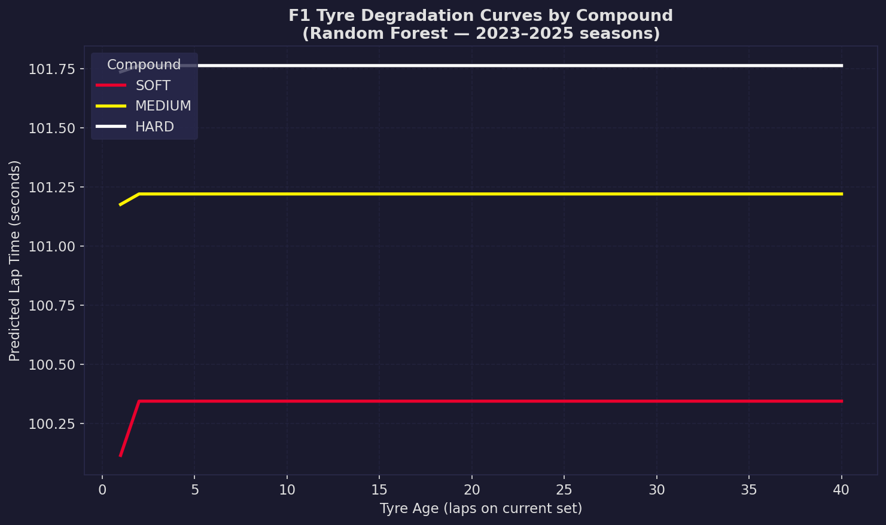
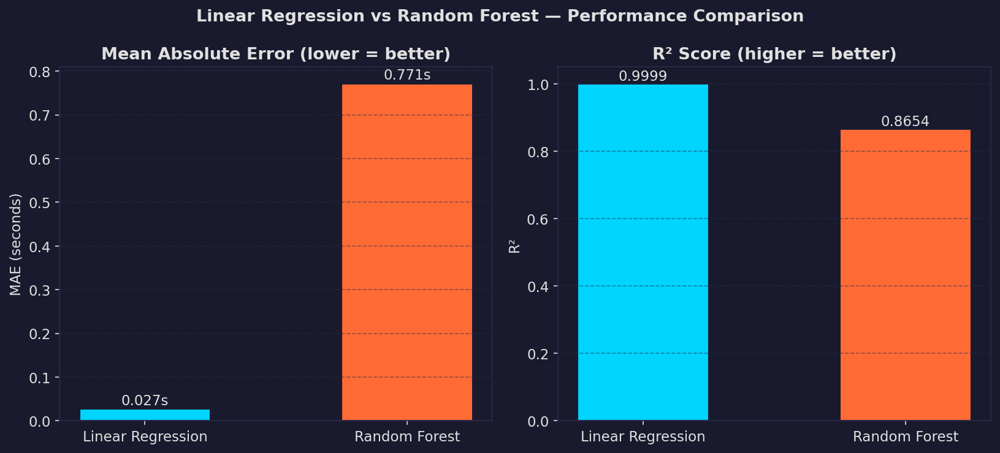
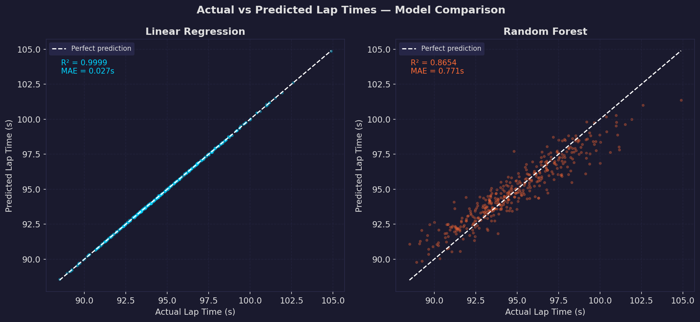
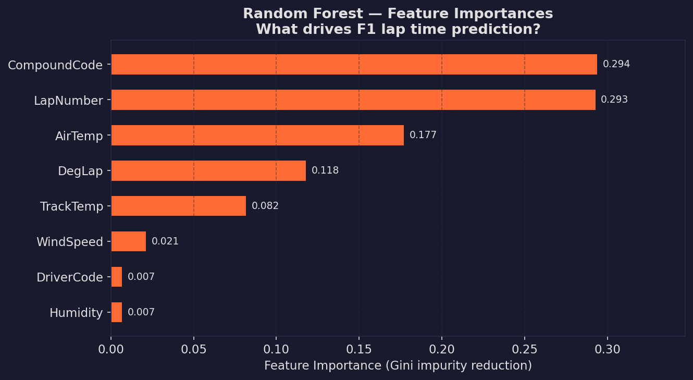

# F1 Tyre Degradation ML

Models how Formula 1 tyre performance degrades over a stint, using real race data from the 2023, 2024 and 2025 seasons, and compares Linear Regression against Random Forest as predictors.

## What it does

- Pulls lap-by-lap data for every race in 2023-2025 via [FastF1](https://github.com/theOehrly/Fast-F1)
- Cleans the data: removes safety car / VSC laps, pit in/out laps, inaccurate laps, and outlier laps (>107% of a driver's median pace)
- Models lap time as a function of tyre life, compound, and track/air temperature
- Compares Linear Regression vs Random Forest on held-out test data
- Visualises degradation curves per compound and per track

## Results

### Tyre Degradation Curves by Compound


### Model Comparison — Linear Regression vs Random Forest


### Actual vs Predicted Lap Times


### Random Forest — Feature Importances


## Project structure

src/
data_loader.py      # fetches and caches race data from FastF1

preprocessing.py    # cleaning and feature engineering

models.py           # Linear Regression + Random Forest training and comparison

visualisation.py    # degradation curve and feature importance plots

outputs/figures/      # saved chart outputs
notebooks/          # exploratory analysis
```

## Setup

```bash
pip install -r requirements.txt
```

## Run

```bash
python -m src.visualisation
```

## Tech stack

Python, FastF1, scikit-learn, pandas, matplotlib, seaborn

## Usage

```bash
# Smoke test: load and clean a single race
python src/preprocessing.py

# Full pipeline: load all seasons
python -c "from src.data_loader import load_season_data; load_season_data().to_csv('data/raw_laps.csv', index=False)"
```

## Status

Data loading and preprocessing complete. Model training and visualisation in progress.
